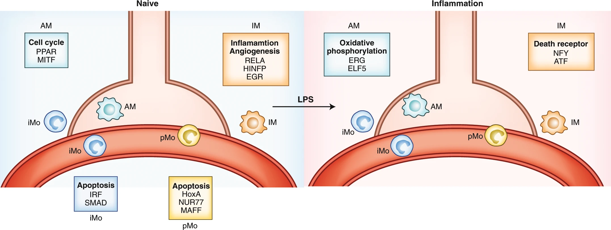
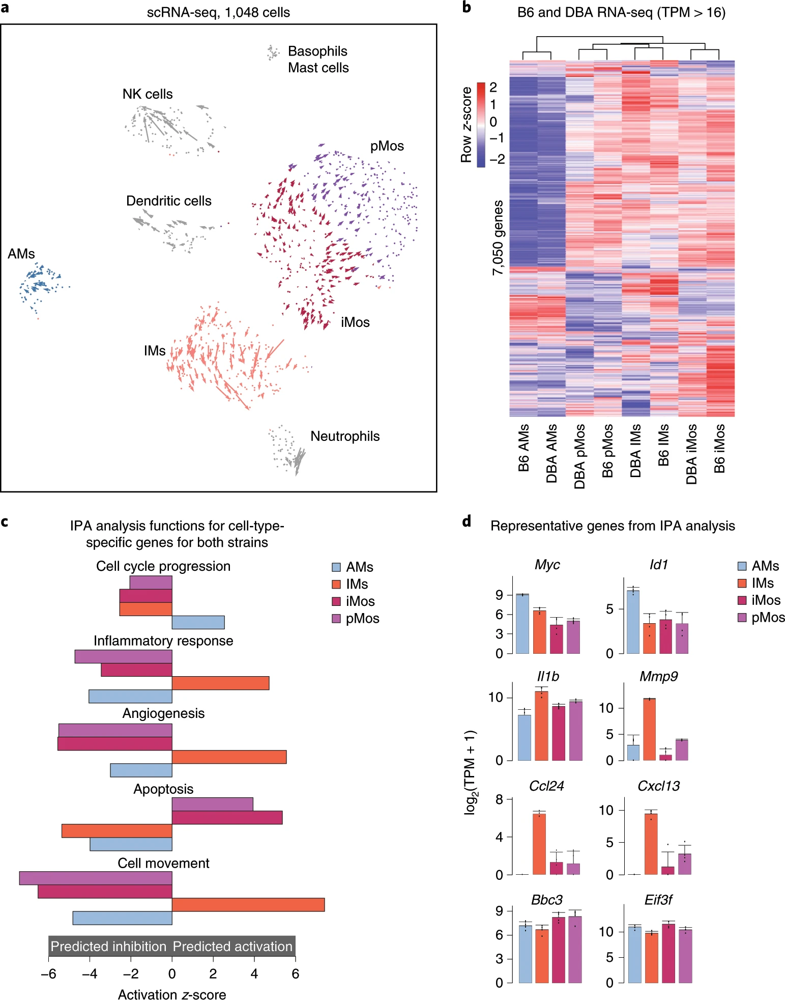

The Sajti Lab is located at the University of California San Diego. The lab's primary interests are to understand the molecular and cellular mechanisms controlling the development of the neonatal innate immune system. Current projects focus on determining the genetic and epigenetic signature of specialized innate immune cells in the neonatal lung and brain.  To understand the relative contribution of various subtypes of innate immune cells to premature birth related lung disease and impaired neurodevelopmental outcomes, we employ genome-wide approaches and computational analyses to identify transcriptional mechanisms unique to each cell type. By elucidating disease and cell type specific gene regulatory networks we hope to develop new therapeutic targets.​

    

	  	

	    	<!-- bkgd image at top -->
	    	

	  	

	

<h2 id="publications" style="margin: 2px 0px -15px;">Publications</h2>

  

    

      1 of 3 columns
    

    

      2 of 3 columns
    

    

      3 of 3 columns
    

  

	
     
		    
  	

	

		
<a href="https://www.nature.com/articles/s41590-019-0582-z">Transcriptomic and epigenetic mechanisms underlying myeloid diversity in the lung</a>

		
Eniko Sajti*, Verena M. Link, Zhengyu Ouyang, Nathanael J. Spann, Emma Westin, Casey E. Romanoski, Gregory J. Fonseca, Lawrence S. Prince & Christopher K. Glass (*Corresponding author)
     
	

 
